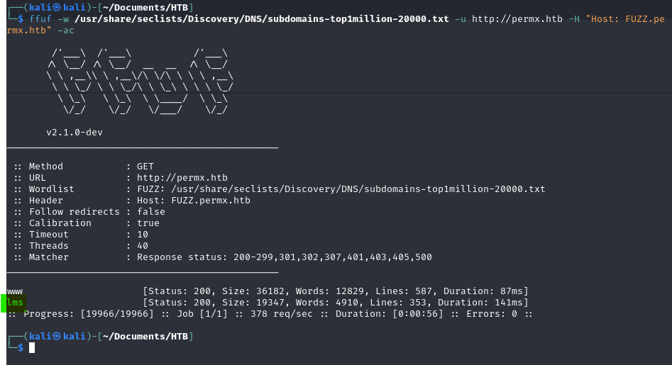
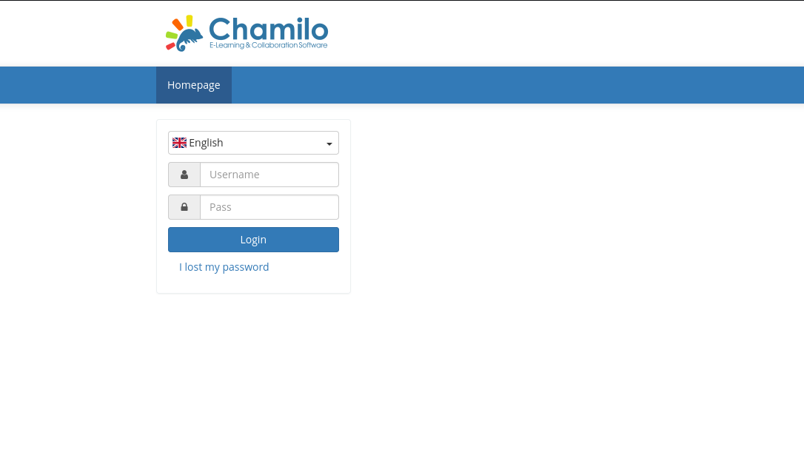

# Permx walkthrough
**OS**: Linux, **Difficulty**: Easy


### Enumeration

Ports scan: ```nmap -p- -sCV 10.10.11.23```
```
PORT   STATE SERVICE VERSION
22/tcp open  ssh     OpenSSH 8.9p1 Ubuntu 3ubuntu0.10 (Ubuntu Linux; protocol 2.0)
| ssh-hostkey: 
|   256 e2:5c:5d:8c:47:3e:d8:72:f7:b4:80:03:49:86:6d:ef (ECDSA)
|_  256 1f:41:02:8e:6b:17:18:9c:a0:ac:54:23:e9:71:30:17 (ED25519)
80/tcp open  http    Apache httpd 2.4.52
|_http-title: Did not follow redirect to fer
|_http-server-header: Apache/2.4.52 (Ubuntu)
Service Info: Host: 127.0.1.1; OS: Linux; CPE: cpe:/o:linux:linux_kernel
```


There's no available exploit for this version of Openssh, and passwordless connexions are not possible.\
The http server redirects to `permx.htb/`, so i added `10.10.11.23 permx.htb` to `/etc/hosts`: ``` sudo echo "10.10.11.23 permx.htb >> /etc/hosts"```.

The website "permx.htb" isn't interesting in itself, so i enumerated potential subdomains:




So, "lms.permx.htb" gives to a Chamilo login portal:



I tried injecting some characters to get a SQL injection, but no result found. And then, i searched for a potential CVE,
